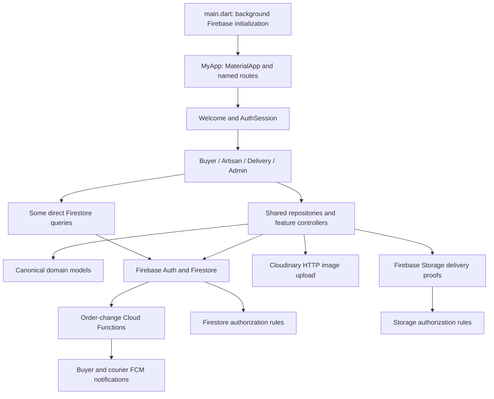

# Technical Lead - Architecture & API Integration Review

Project: IT3060 HCI Milestone 02, Group WE_114  
Parent: CRAF-1 Cross-Module Integration & Project Delivery  
Review date: 11 October 2026 (Asia/Colombo)  
Reviewed HEAD: d633c0e1cd7be0ea08f7911a9632b9bbe6008b3a

## Scope and evidence limits

Reviewed local Flutter architecture, Firebase configuration, repository contracts, security rules, cross-module workflows and actual Git history; subsequently remediated confirmed failures under the explicit implementation request. This document is evidence for the Jira review task; it does not update Jira status or deploy backend changes. Local working-tree Follow Artisan changes were present during review and are identified separately from committed evidence. GitHub links below are constructed from the configured origin and real local commit hashes; remote availability has not been checked.

## Architecture

The app uses feature folders for auth, buyer, artisan, delivery and admin, with shared domain models and repositories. This is a feature-oriented Flutter app using widgets, ChangeNotifier controllers and Firestore streams; it is not a strict implementation of Clean Architecture. UI files still contain some direct Firestore queries and fixture/adaptor models.



## Source evidence

| Area | Repository evidence | What was verified in code |
|---|---|---|
| Startup and routing | lib/main.dart; lib/app.dart; lib/routes/app_routes.dart | Welcome paints while Firebase initializes; named routes cover all modules and admin access uses a route guard. |
| Identity and roles | lib/features/auth/services/auth_session.dart | Firebase Auth UID, server-side user-profile role reads, session-change checks and role-based routing. |
| Marketplace integration | lib/shared/data/marketplace_repository.dart | Constructor injection for Firestore/Auth; per-user subcollections; transactions for stock, checkout, delivery assignment and order advancement; currency validation. |
| Domain contracts | lib/shared/models/domain_models.dart | User/Product/Order/Review serialization; shared role/status enums; numeric price conversion; currency on product and order. |
| Buyer and artisan adapters | lib/features/buyer/buyer_demo.dart; lib/features/artisan/artisan_demo.dart | Feature state adapts repository/domain data for screens; stream-driven refresh and error state. |
| Community APIs | lib/shared/data/community_repository.dart | Conversations/messages, product reviews and artisan profiles; reviews checked against delivered orders. |
| Profile integration | lib/shared/data/profile_repository.dart | User-profile streams and UID-scoped profile writes. |
| Delivery integration | lib/shared/data/delivery_workflow_repository.dart | Assigned-courier checks, delivery attempts/plans, proof upload and buyer confirmation-code access. |
| HTTP contract | lib/shared/data/cloudinary_upload.dart | Multipart POST to Cloudinary; 10 MB limit; 60-second timeout; status and secure_url validation. |
| Notifications | functions/index.js; functions/buyer.js; functions/delivery.js | Firestore order-change triggers and buyer/courier FCM workflows. |
| Backend configuration and authorization | firebase.json; lib/firebase_options.dart; firestore.rules; storage.rules | Firebase project configuration, Android options, UID/role access restrictions and emulator configuration. |

## Remediation report - 11 October 2026

The local code fixes below supersede the initial review's 30-pass/5-fail selected-test result. The complete final Flutter run passed 169 tests. Existing uncommitted Follow Artisan work was preserved and extended; no Git commits, pushes, Firebase deployments or device installations were performed. HEAD remains d633c0e1cd7be0ea08f7911a9632b9bbe6008b3a. All new remediation is working-tree evidence, not a new commit.

### 1. Outdated Welcome/widget expectations - fixed

- **Root cause:** four saved-role tests expected Get Started and one offline-Welcome test expected Sign In. Current Welcome intentionally uses Explore the marketplace and Sign in. Other navigation tests used the same stale selectors; profile/admin selectors also reflected older UI.
- **Files changed:** test/auth_session_test.dart; test/widget_test.dart; test/auth_screen_test.dart; test/collector_profile_header_test.dart; test/admin_dashboard_test.dart; test/admin_artisan_review_test.dart; test/helpers/admin_test_store.dart; lib/features/auth/screens/welcome_screen.dart.
- **Fix:** updated selectors to the current UI while retaining navigation, validation and persistence assertions. Admin fixtures are now supplied explicitly from test-only data; production stays empty offline and unauthenticated admin preview remains unavailable. The narrow-screen Welcome tagline now wraps within its available width.
- **Tests:** all five originally reported cases, onboarding/navigation tests and updated auth/profile/admin tests pass in the final 169-test run. Admin focused run: 7/7 passed.
- **Remaining risks:** widget tests exercise local navigation/layout, not production administrator authorization. No preview capability was restored.
- **Existing commit evidence:** d633c0e (startup/Welcome initialization); a363e51 (role-check/auth tests). These are historical evidence, not commits for this fix.
- **Jira-ready comment:** Updated the five outdated Welcome expectations and related stale UI selectors. Retained routing/security assertions, isolated admin fixtures to tests and corrected a narrow-screen tagline overflow. Final Flutter suite passed 169/169; no production preview access was added.

### 2. Trusted Product aggregate contract - fixed, producer deferred

- **Root cause:** Product serialized rating/reviewCount/soldCount, but validProduct rules rejected those keys. saveProduct reconstructed and replaced documents, dropping backend-owned aggregates on edits. A stock/name edit could therefore fail or remove existing totals.
- **Files changed:** lib/shared/models/domain_models.dart; lib/shared/data/marketplace_repository.dart; firestore.rules; test/marketplace_repository_test.dart; tools/firestore-tests/checkout.test.mjs.
- **Fix:** Product.toMap/toJson keep read/snapshot serialization. Product.toWriteMap excludes all three trusted fields. Product saves now re-read ownership and current data inside a transaction, update only writable details for existing documents, preserve current aggregate values and original createdAt representation, and return the merged canonical record. Rules allow existing aggregate keys but reject client creation, modification or deletion of aggregate fields. Forged draft values are ignored by the repository; direct forged Firestore writes are denied.
- **Tests:** repository tests preserve totals and a Timestamp date despite a forged draft; creation strips forged totals. Emulator tests deny buyer/artisan aggregate modification and deletion, deny forged creation, and allow an ordinary artisan edit with existing server totals. Final emulator suite: 23/23 passed.
- **Remaining risks:** no sold-count aggregation producer has been implemented. Backend Admin SDK writers remain the trusted writers; existing missing aggregates remain missing rather than displaying invented totals. Deploy updated rules before production edits of products containing aggregate fields.
- **Existing commit evidence:** 8848c6c (product rating/review feature); 68c2fcb (marketplace/model integration).
- **Jira-ready comment:** Reconciled Product serialization with rules using separate client-write details and immutable server-owned aggregates. Transactional edits preserve current totals and dates. Tampering/creation/deletion protections passed emulator tests. Aggregate production is outside this fix and remains a documented follow-up.

### 3. Date contracts and existing documents - fixed

- **Root cause:** canonical _date and Order.updatedAt parsing assumed ISO strings; Firestore review/user/subdocument writers also use Timestamp. Notification sorting and review rendering assumed Timestamp and failed on legacy ISO values.
- **Files changed:** lib/shared/models/domain_models.dart; lib/features/buyer/buyer_demo.dart; lib/features/buyer/product_reviews.dart; test/domain_models_test.dart; test/marketplace_repository_test.dart.
- **Fix:** shared documentDate accepts ISO strings, Firestore Timestamp and DateTime. Timestamp reads normalize to UTC; optional null dates stay null and invalid required values fail explicitly. All canonical model date fields use this boundary, including Order.updatedAt. Notification/review sorting and displayed review dates use the same reader. Existing product/order ISO serialization is unchanged; editing an existing product preserves its original date value/type. Product rules accept both existing ISO and Timestamp creation dates while still enforcing immutability on edits.
- **Tests:** mixed date representations, null/invalid dates, canonical order createdAt/updatedAt, ISO round trips and existing Timestamp product edits pass in the final suite.
- **Remaining risks:** malformed dates are not silently repaired. Backend documents with invalid required dates need deliberate data correction. This change does not migrate stored documents or interpret arbitrary epoch numbers.
- **Existing commit evidence:** 24085dd (domain contracts); 68c2fcb (shared model integration).
- **Jira-ready comment:** Added compatible ISO/Timestamp/DateTime reads at the document boundary and removed Timestamp-only notification/review assumptions. Existing write formats remain intact; malformed values fail explicitly. Date regression tests passed.

### 4. Correctness-focused dependency injection - fixed

- **Root cause:** BuyerArtisanProfile chose backend behavior from a global flag and created default CommunityRepository instances, ignoring BuyerDemo's supplied backend. Its conversation screen also used the default Firebase instances. ArtisanDemo did not accept an injected backend.
- **Files changed:** lib/features/buyer/buyer_marketplace.dart; lib/shared/widgets/craftisan_messaging.dart; lib/features/artisan/artisan_demo.dart; test/artisan_backend_injection_test.dart; existing test/buyer_follows_test.dart exercises the injected buyer profile path.
- **Fix:** buyer profile/review subscriptions use the same injected Firestore/Auth instances as BuyerDemo, including profile-stream error handling. The profile conversation passes its CommunityRepository into the conversation screen. ArtisanDemo accepts an optional MarketplaceRepository and passes its clients to CommunityRepository. Existing default production constructors and fixture mode continue to work.
- **Tests:** artisan profile creation, registered-name loading and live updates work without a global Firebase application; injected buyer profile/follow/button and existing messaging tests pass in the final suite.
- **Remaining risks:** direct/global Firebase access still exists elsewhere by design. This is a targeted correction, not an architectural rewrite; notification singletons and inbox flows were not broadly refactored.
- **Existing commit evidence:** cd6f774 (profile/name integration); a363e51 (community/review integration).
- **Jira-ready comment:** Corrected backend injection in buyer artisan-profile/conversation and artisan state paths. Added an isolated artisan backend test and verified existing buyer/messaging behavior. No new service layer or dependency was introduced.

### 5. Firebase platform configuration - reviewed and retained

- **Root cause:** the repository only contains valid Android Firebase configuration. Unsupported platforms deliberately throw instead of using another platform's credentials; this is a configuration boundary, not an Android defect.
- **Files changed:** test/firebase_platform_configuration_test.dart. lib/firebase_options.dart, Android Firebase credentials and application IDs are unchanged.
- **Fix:** retained Android support and explicit rejection for unsupported platform options. Added checks for the existing Android project and unsupported native targets. No fabricated credentials or extra Firebase apps were created.
- **Tests:** six platform-option tests pass (Android plus Fuchsia/iOS/Linux/macOS/Windows). No web/iOS/desktop production build or device connectivity claim is made.
- **Remaining risks:** actual Android Firebase network/auth behavior requires device testing. Supporting other platforms requires valid platform-specific configuration supplied through the project owner.
- **Existing commit evidence:** 24085dd is the existing commit returned by Git history for lib/firebase_options.dart; current generated options are inspected source evidence.
- **Jira-ready comment:** Confirmed Android Firebase options and added platform-boundary regression tests. Android credentials remain unchanged; unsupported platforms remain explicitly unsupported pending valid configuration.

### 6. Follow Artisan persistence and ownership - preserved and verified

- **Root cause:** the original feature used a display-name-keyed in-memory set. The working tree already contained the approved follow persistence implementation when this remediation started.
- **Files changed/preserved:** lib/features/buyer/buyer_demo.dart; lib/shared/data/marketplace_repository.dart; the follow button section of lib/features/buyer/buyer_marketplace.dart; firestore.rules; test/buyer_follows_test.dart; test/buyer_artisan_profile_test.dart; tools/firestore-tests/buyer_follows.test.mjs.
- **Fix:** retained users/{buyerUid}/followedArtisans/{artisanUid} and the existing repository architecture. Live subscriptions reload saved IDs and clear them on auth changes. Writes require an authenticated non-anonymous buyer; loading/pending/error states and retry prevent invalid or duplicate changes. Rules restrict reads/writes/deletes to the owning non-anonymous buyer and validate the target artisan/payload. Added disposal guards without replacing the working local changes.
- **Tests:** follow/unfollow, reopening, live updates, separate-buyer restoration, sign-out, anonymous rejection, pending duplicate taps, failed writes, read retry and button synchronization pass. Emulator tests reject cross-buyer access, guests/non-buyers, nonexistent targets and malformed payloads.
- **Remaining risks:** this work remains uncommitted. Offline Firestore writes can remain pending until server acknowledgement; device/offline behavior is not claimed from the mocks. Production rules deployment is required.
- **Existing commit evidence:** no actual commit for the follow fix exists; do not label it with an unrelated commit hash. The source/test working tree is the evidence until a commit is explicitly authorized.
- **Jira-ready comment:** Preserved and verified UID-based follow persistence, live button synchronization, failure handling and buyer isolation. Flutter and emulator follow checks passed. Changes remain local/uncommitted; rules deployment is pending approval.

### 7. Complete validation and production evidence boundary - local validation complete

- **Root cause:** earlier review evidence was limited to selected tests and code/configuration inspection. Full suites contained stale UI/fixture assumptions and a real small-width price-wrapping overflow. Live production deployment/device behavior was unverified.
- **Files changed:** firebase.json (local Storage emulator port only); tools/firestore-tests/package.json; tools/firestore-tests/README.md; test-only UI selectors/fixtures listed above; lib/features/buyer/buyer_marketplace.dart (single-line constrained card price); this report and docs/architecture-api-integration-validation.txt.
- **Fix:** added a reproducible sequential all-suite Firestore/Storage runner to avoid shared-demo-project clearing races. Ran all Flutter tests, source/test analysis, backend function logic tests and all emulator rule suites. Constrained long card prices to one line to avoid 320 px overflow while retaining the full semantic text; UI design is unchanged.
- **Tests:** final complete Flutter run: 169 passed, 0 failed. Dart analysis of lib/test: no issues. Backend notification logic: 6 passed, 0 failed. Firestore/Storage integration: 23 passed, 0 failed. Earlier failing/intermediate runs are superseded by these final results, not presented as passes.
- **Remaining risks:** emulator success is not production deployment or real-device evidence. Functions trigger registration, FCM delivery, Cloudinary upload configuration, release builds and real Firebase credentials/connectivity still need device/project verification. No deploy, commit or push occurred.
- **Existing commit evidence:** fedf4a0 (buyer notifications); 58b65f4 (delivery notifications/proof storage); 68c2fcb (cross-module integration). These are historical supporting commits.
- **Jira-ready comment:** Completed local architecture/Firebase remediation and regression validation: Flutter 169/169, Dart analysis clean, backend logic 6/6, Firestore/Storage emulator checks 23/23. Production rule deployment, functions/version verification and real-device end-to-end evidence remain pending approval/access; no commits, pushes or deployments were performed.

## Reproducible validation

Run from the repository root with the Flutter SDK, Node.js and Java 21 available:

```text
flutter test --no-pub
dart analyze lib test
node --test functions/buyer.test.js functions/delivery.test.js
firebase emulators:exec --only firestore,storage --project demo-craftisan "npm --prefix tools/firestore-tests run test:all"
```

The emulator command uses the isolated demo-craftisan project and runs all four rule suites sequentially. The checked-in firebase.json Storage emulator port is 9199; Firestore remains 8187. See architecture-api-integration-validation.txt for captured result evidence. Full raw logs are retained locally in flutter-review-final-tests.log, dart-review-analysis.log, backend-review-tests.log and firebase-review-tests.log; *.log files are ignored by Git.

## Production deployment and real-device tasks - not executed

1. Review the local diff and emulator evidence, especially immutable aggregates and buyer-only follow rules. Confirm the target Firebase project is craftisan-we114-2026 before any approved deployment.
2. After explicit deployment approval, publish Firestore rules with `firebase deploy --only firestore:rules --project craftisan-we114-2026`. No Storage rule changes were needed here; compare existing deployed Storage rules before authorizing any separate publish.
3. Verify the currently deployed notifyBuyerOrderUpdates/notifyDeliveryRequests functions against the desired source. No function source changes were made by this remediation; authorize a functions deployment only if verification shows it is needed. Confirm function codebase/region from project configuration.
4. On Android devices using real test accounts, verify two-buyer follow isolation, close/reopen follow persistence, write rejection/retry, logout/account switching and offline/reconnect behavior.
5. Verify artisan product edits preserve backend-owned aggregates; confirm legacy ISO and Timestamp records load. Do not populate ratings or sold totals through client accounts.
6. Complete a real buyer -> artisan confirmation -> courier assignment/pickup -> delivery-code completion flow, checking stock, totals, participants and private proof access.
7. Verify real buyer/courier notification receipt and taps in foreground, background and closed-app states, plus Cloudinary product upload and Firebase Storage proof upload.
8. Capture device/build version, account roles, sanitized screenshots, deployment versions, results and actual commits once separately authorized. Do not mark the entire production/device verification task complete using emulator evidence alone.

## Actual Git commits

These are real existing implementation commits inspected in local Git history. They support architecture/integration evidence; they are not newly created review commits and are not all authored by the assignee.

| Commit | Date | Author | Actual commit title |
|---|---|---|---|
| [68c2fcb](https://github.com/arindu123/handicraft_marketplaceapp/commit/68c2fcbb0f91f266937e39aa2ca1846ed9b22474) | 2026-10-10 | Pasinduk254 | Update Craftisan UI, delivery features, authentication and Firestore integration |
| [a363e51](https://github.com/arindu123/handicraft_marketplaceapp/commit/a363e5161dc77289e94cc7d0344b50eff08bd726) | 2026-10-10 | Semal Amarajeewa | Add product reviews feature and enhance cart functionality; implement role checks and related tests |
| [fedf4a0](https://github.com/arindu123/handicraft_marketplaceapp/commit/fedf4a08d05c2436a83f3559c65e38642d3dc1c0) | 2026-10-10 | Semal Amarajeewa | Implement buyer notifications and order update alerts; enhance Firestore rules and add related tests |
| [cd6f774](https://github.com/arindu123/handicraft_marketplaceapp/commit/cd6f774bdf8fde7ef34551dabfc7733cb98bb3e5) | 2026-10-10 | Semal Amarajeewa | Add user profile stream and utility function to read names |
| [58b65f4](https://github.com/arindu123/handicraft_marketplaceapp/commit/58b65f411e498f4990551104a83cebc9c776c424) | 2026-10-08 | Pasinduk254 | feat: add delivery notifications and storage for delivery proofs |
| [d633c0e](https://github.com/arindu123/handicraft_marketplaceapp/commit/d633c0e1cd7be0ea08f7911a9632b9bbe6008b3a) | 2026-10-11 | Semal Amarajeewa | Enhance welcome screen functionality and initialization handling; add tests for startup behavior and error handling |
| [8848c6c](https://github.com/arindu123/handicraft_marketplaceapp/commit/8848c6c175be2793812c3b0d195183964ef23e31) | 2026-10-10 | Semal Amarajeewa | Implement brand splash screen and enhance app launch experience; add product rating and review features |
| [24085dd](https://github.com/arindu123/handicraft_marketplaceapp/commit/24085dd948be47d070b2c7b9878cda1db465bf9f) | 2026-10-03 | Semal Amarajeewa | feat: Add domain models for users, products, orders, and messaging |

## Jira follow-up work

- Approve and deploy reviewed Firestore rules to the explicitly confirmed production project.
- Verify deployed functions/Storage configuration and gather Android real-device end-to-end evidence.
- Define a trusted server aggregate producer if product sold/rating totals are required; do not grant client aggregate write access.
- Authorize a commit/push separately if actual remediation commit evidence is required.

## Paste-ready Jira completion comment (local implementation and validation)

Reviewed and fixed the confirmed Craftisan architecture/Firebase integration defects while preserving the existing module design and working follow changes. Updated stale Welcome/UI test selectors, protected and preserved server-owned Product aggregates, added compatible ISO/Timestamp date parsing, corrected targeted backend injection, retained Android-only Firebase configuration, and verified authenticated UID-scoped follow persistence/security.

Final local validation: all 169 Flutter tests passed; Dart analysis of lib/test reported no issues; backend notification logic tests passed 6/6; all Firestore/Storage emulator tests passed 23/23. Attached report contains per-issue root causes, changed files, fixes, test evidence, remaining risks and real historical commit links.

No Git commit/push or Firebase deployment was performed. Production rules deployment, deployed-function/version checks and real Android device end-to-end/notification evidence remain pending explicit approval or project/device access. Complete the local review/fix scope only; track these production tasks separately rather than claiming they were verified.
